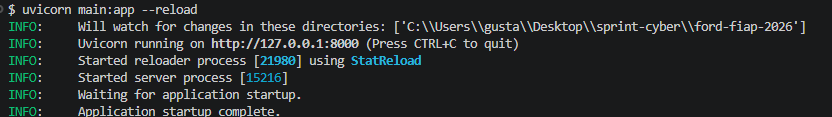
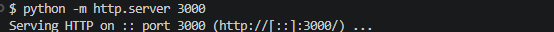
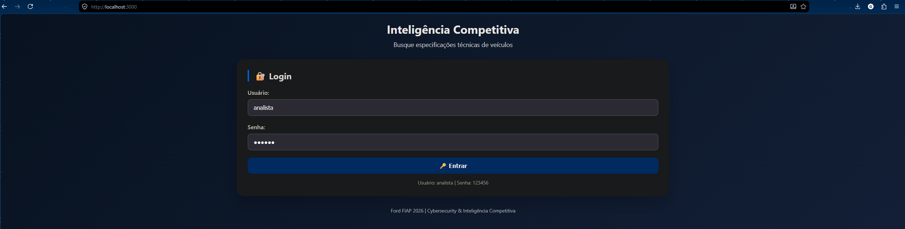
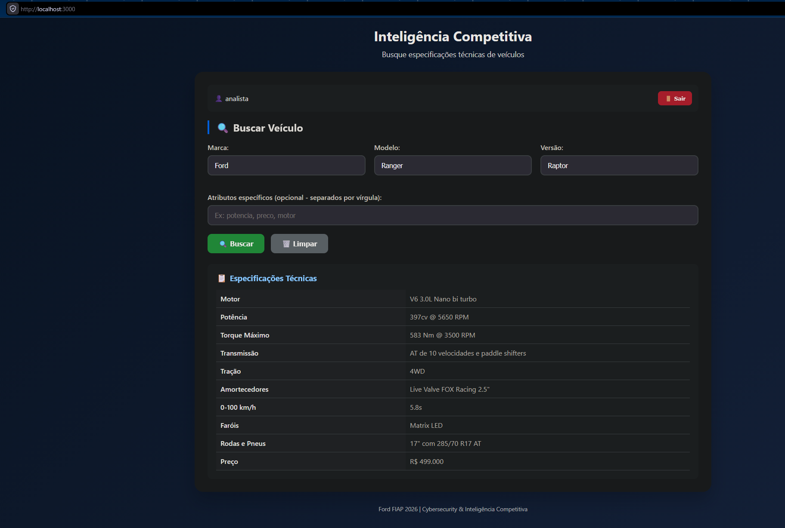
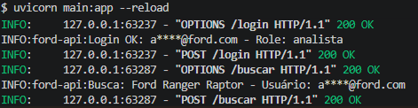
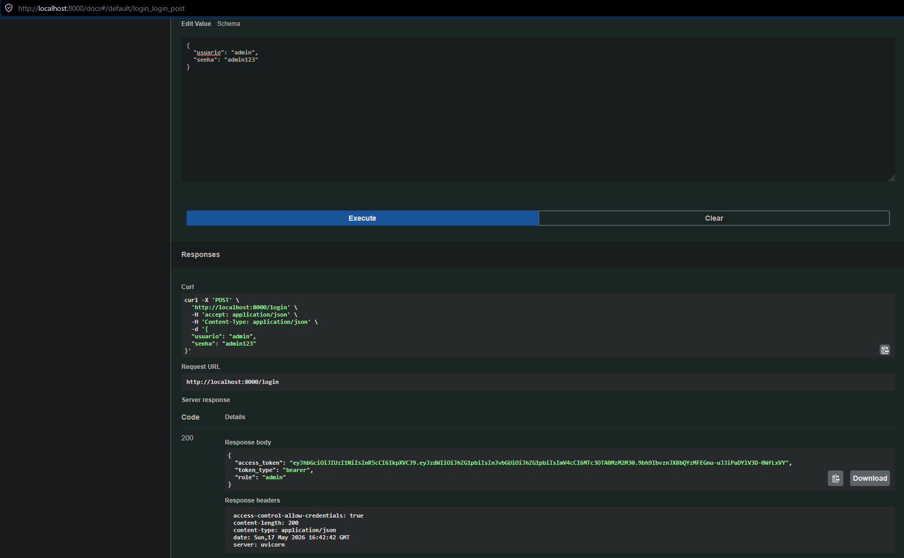
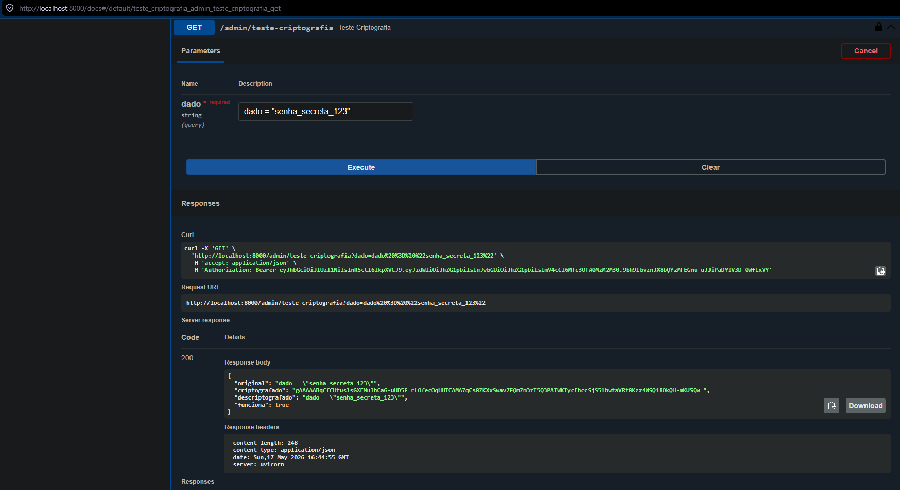

# 🚗 Ford Inteligência Competitiva

API da Ford FIAP 2026 (Desafio 01 - Inteligência Competitiva Automotiva) com foco em **Cybersecurity / DevSecOps**.

## 🛡️ Controles de segurança (Sprint 3)

| Área | Controle |
|---|---|
| Segredos | Somente por variáveis de ambiente; a API **não sobe** se faltar/for fraco |
| Senhas | Hash Argon2id, comparação em tempo constante, sem enumeração de usuários |
| JWT | HS256 fixo, `iss/aud/exp/iat/nbf/jti` obrigatórios, expira em 15 min, revogação via `/logout` |
| Acesso | RBAC no servidor (`analista` / `admin`) |
| Entrada | Validação por allow-list, campos extras rejeitados, sem eco do payload |
| Abuso | Rate limit por IP + bloqueio de conta após 5 falhas |
| Dados | Histórico criptografado (Fernet) com rotação de chaves (MultiFernet) |
| Observabilidade | Logs JSON com `request_id`, e-mails anonimizados, métricas Prometheus em `/metrics` |
| HTTP | Cabeçalhos de segurança, CORS restrito, erros genéricos, Swagger desligado em produção |
| Frontend | Sem credenciais na tela, sem `innerHTML` (anti-XSS), CSP |
| Pipeline | GitHub Actions: Gitleaks, Bandit, pip-audit, pytest, Trivy, deploy condicionado |

## 📦 Instalação

```bash
git clone https://github.com/YujiSam/ford-fiap-2026.git
cd ford-fiap-2026
python -m venv venv
source venv/Scripts/activate      # Windows (Git Bash) | Linux/Mac: source venv/bin/activate
pip install -r requirements.txt
```

## 🔑 Configuração (obrigatória)

```bash
cp .env.example .env
```

Abra o `.env` e substitua **todos** os `TROQUE_ME`:

```bash
python -c "import secrets; print(secrets.token_urlsafe(48))"                       # JWT_SECRET
python -c "from cryptography.fernet import Fernet; print(Fernet.generate_key().decode())"   # FERNET_KEYS
```

`ANALISTA_PASSWORD` e `ADMIN_PASSWORD` (mín. 12 caracteres) e `METRICS_TOKEN` (mín. 24) você mesmo define. **Nunca faça commit do `.env`.**

## 🚀 Como executar

```bash
# Terminal 1 - API
uvicorn main:app --reload

# Terminal 2 - Frontend
cd frontend && python -m http.server 3000
```

API: http://localhost:8000 (Swagger em `/docs`) | Frontend: http://localhost:3000

## 🧪 Testes e varreduras de segurança

```bash
pip install -r requirements-dev.txt
python -m pytest tests -v --cov=main      # 37 testes de segurança
bandit -r main.py                         # SAST
pip-audit -r requirements.txt             # SCA
python scripts/simular_ataques.py http://localhost:8000 SENHA_ANALISTA SENHA_ADMIN   # gera logs/alertas
```

## 📡 Exemplos

```bash
curl -X POST http://localhost:8000/login -H "Content-Type: application/json" \
  -d '{"usuario":"analista","senha":"SUA_SENHA"}'

curl -X POST http://localhost:8000/buscar -H "Content-Type: application/json" \
  -H "Authorization: Bearer SEU_TOKEN" -d '{"marca":"Ford","modelo":"Ranger","versao":"Raptor"}'
```

## 📸 Evidências de Funcionamento

### API rodando no terminal


### Frontend rodando no terminal


### Tela de login


### Login realizado e busca da Ranger Raptor


### Logs anonimizados no terminal


### Swagger - Login do admin


### Teste de criptografia


# Integrantes 👤​
### Gustavo Yuji Osugi RM555034

### Gustavo Viega RM555885

### Kaio Drago Lima Souza RM556095

### Vitor Rivas Cardoso RM556404

### Otavio Santos de Lima Ferrão RM5556452

